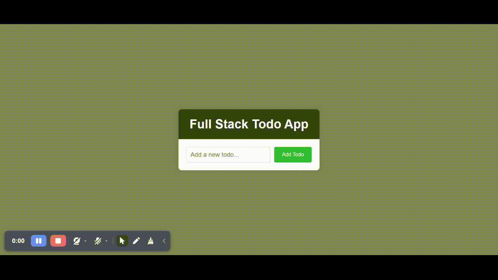

## MERN Stack Todo App

This Mini project contains a basic MERN (MongoDB, Express.js, React.js, Node.js) stack todo application. The app provides a simple boilerplate for CRUD (Create, Read, Update, Delete) operations.

### Technologies Used

- MongoDB for database storage
- Express.js for backend server
- React.js for the frontend user interface
- Node.js for server-side JavaScript

### Instructions for Local Development

#### Prerequisites

- Node.js installed on your machine
- MongoDB Atlas account and database URL

#### How to run the application locally

Go to the `client` and `server` folders and run `npm install` to install the dependencies for the frontend and backend. In terminal run `npm run dev` both in client and server directory to start the development server.

Replace `<PLEASE ADD YOUR MONGODB CONNECTION STRING HERE>` with your actual MongoDB Atlas database URL in the `server.js` file.

### Note to Developers

This app intentionally kept simple to provide a basic boilerplate for a MERN stack application. Ofcourse, we can follow more best practices and industry standards to make it more maintainable like using environment variables, error handling, separate routes, separate controllers, and Database connection file, etc.

### Output

## Connect with Me

Embarking on the journey of mastering JavaScript is an exciting adventure, and I'm here to support you at every turn! If you have questions, feedback, or a desire to contribute and enhance this resource, please don't hesitate to reach out.

## 🚀 Explore More Tech Goodies

Ready for a tech journey? Check out these cool resources:

📘 **[Js Playbook](https://github.com/zeeshanMukhtar1/js-Playbook/)** - Learn everything about JavaScript from the basics to advanced stuff. It's like a guidebook for becoming a JavaScript champion!

🌟 **[Coursera Application Procedure](https://github.com/ZeeshanMukhtar1/Coursera-Financial-Aid-Application)** - Want to save some bucks on courses? This guide helps you easily apply for financial aid on Coursera.-step guide to applying for financial aid on Coursera.

