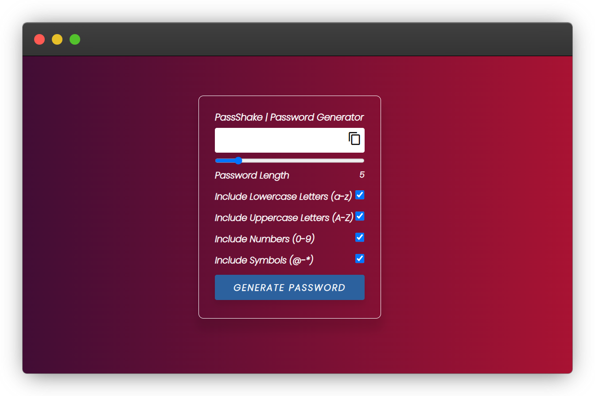
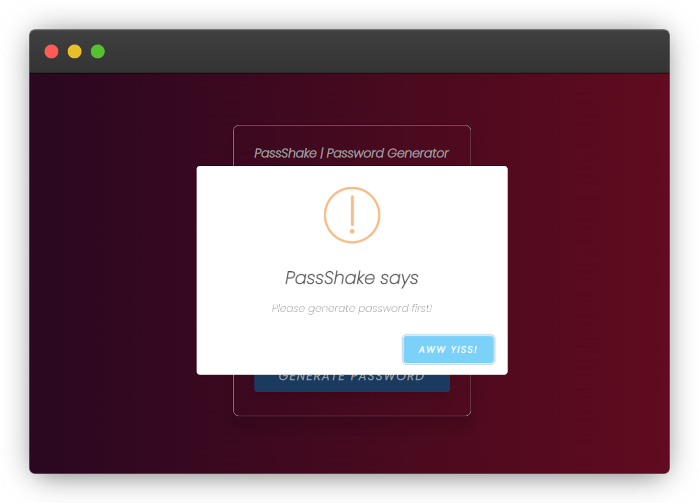

# Random Password Generator

This is a simple web application that generates a random password based on the user's selected criteria.

## Usage

- Move the slider to set the desired length of the password.
- Check the boxes for the types of characters you want to include in the password (lowercase letters, uppercase letters, numbers, and symbols).
- Click the "Generate" button to generate a random password.
- Click the "Copy" button to copy the generated password to your clipboard.

## Code

The code for the random password generator is written in JavaScript and HTML, and can be found in the index.html and script.js files in this repository.

## Author

This application was created by [Zeeshan Mukhtar](https://twitter.com/ZeshanMukhtar01).

## Screenshots

